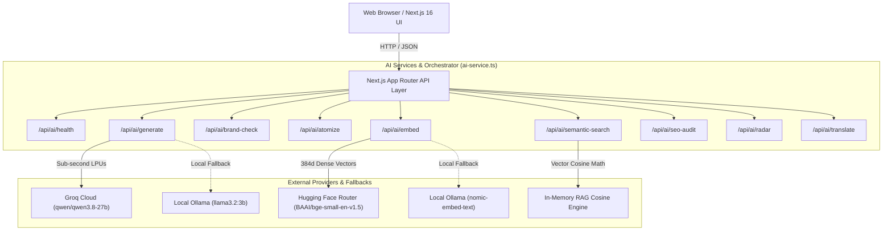

<div align="center">

# ⚡ Nexus: Enterprise B2B AI Content OS & Workspace

**Governed AI-powered content orchestration platform for high-velocity B2B teams.**  
*Sub-second generative completions, dense semantic vector search, deterministic brand voice guardrails, and omnichannel atomization.*

[](https://nextjs.org/)
[](https://turbo.build/)
[](https://groq.com/)
[](https://huggingface.co/)
[](https://www.typescriptlang.org/)
[](https://tailwindcss.com/)
[](https://github.com/DevanshGupta099/The-B2B-SaaS-AI-Powered-Content-Hub-Workspace)

</div>

---

## 🌟 Executive Summary

**Nexus** is an enterprise-grade Content Operating System designed for modern B2B SaaS marketing, product, and leadership teams. Traditional content workflows suffer from fragmented draft files, non-deterministic AI brand drift, high agency costs, and manual cross-channel reformatting. 

Nexus unifies every stage of content production into a single governed operating system powered by:
- **Groq LPUs**: Sub-second (~200ms) LLM generation powered by `qwen/qwen3.8-27b`.
- **Hugging Face Dense Router**: 384-dimensional dense semantic embeddings using `BAAI/bge-small-en-v1.5`.
- **Deterministic Brand Governance**: Whole-word regex linters that detect forbidden corporate buzzwords and automatically rewrite drafts with a **1-Click AI Fix**.
- **Omnichannel Atomizer**: Transforms 1 brief into 6 production-ready channel assets (LinkedIn, X/Twitter thread, Email newsletter, Video script, SEO meta, Executive memo).
- **Local Private LLM Fallback**: Native fallback support for local Ollama instances (`llama3.2:3b` & `nomic-embed-text`).

---

## 🏛️ System Architecture



---

## 🚀 Core Platform Modules

| Module | Route | Key Capabilities |
| :--- | :--- | :--- |
| **Overview & Intelligence** | `/dashboard` | High-level metrics, active documents, team velocity, token consumption. |
| **AI Document Studio** | `/dashboard/ai-studio` | Multi-model picker, prompt copilot, 4 pre-built recipes, slash actions (`/summarize`, `/punchy`, `/expand`), version history. |
| **Omnichannel Atomizer** | `/dashboard/repurpose` | Transforms 1 whitepaper into LinkedIn posts, X threads, newsletters, video scripts, and SEO tags. |
| **Brand Kit & Voice Engine** | `/dashboard/brand-kit` | Buzzword linter with **1-Click AI Fix**, brand rules, and dense semantic vector search over knowledge base. |
| **Autonomous Agents** | `/dashboard/agents` | Custom persona agents (Technical Writer, Viral Hook Specialist, Ghostwriter, SEO Strategist) with live telemetry. |
| **Editorial Pipeline & Planner** | `/dashboard/planner` | 7-stage Kanban workflow, interactive calendar grid, list table, and velocity Gantt timeline. |
| **Digital Asset Management (DAM)** | `/dashboard/dam` | Folders, natural language visual search, AI auto-tagging, generative FLUX image creator, and 1-click cutout. |
| **SEO Intelligence Hub** | `/dashboard/seo` | SERP competitiveness audit, real-time score gauge, meta tags, and semantic LSI entity rendering with 1-click HTML copy. |
| **Competitive Radar** | `/dashboard/radar` | Threat tracking, automated sales battlecard counter-positioning angles, and market alert feed. |
| **Global Localization** | `/dashboard/localization` | Cultural transcreation engine with nuance notes, quality score, and protected glossary preservation. |
| **Publishing Hub** | `/dashboard/publish` | Multi-channel social scheduling calendar, platform previews, and status queues. |
| **Approvals & Governance** | `/dashboard/approvals` | Multi-stakeholder review pipeline with legal compliance verification stamps. |
| **Client Portal** | `/dashboard/client-portal` | Whitelabel external client review workspaces with password protection and comment threads. |
| **Executive Analytics & ROI** | `/dashboard/analytics` | Quantifies hours saved, estimated dollar ROI ($43k+), brand consistency index (98.4%), and channel attribution. |
| **Collaborative Editor** | `/workspace/[id]` | Multiplayer CRDT-simulated editor, inline AI helper bar, and real-time `@ai` assistant comments. |
| **Settings & Administration** | `/settings` | AI connectivity test, RBAC roles, token meter, API key generation, 2FA, and security audit log. |

---

## 📡 Production AI API Reference

All AI endpoints are located under `/api/ai/*` and support JSON payloads:

### 1. Health & Telemetry
- **Endpoint**: `GET /api/ai/health`
- **Response**:
```json
{
  "status": "healthy",
  "latencyMs": 761,
  "providers": {
    "groq": { "status": "connected", "model": "qwen/qwen3.8-27b" },
    "huggingface": { "status": "connected", "model": "BAAI/bge-small-en-v1.5", "dimensions": 384 },
    "ollama": { "status": "offline", "url": "http://localhost:11434", "model": "llama3.2:3b" }
  },
  "configuredLLMProvider": "groq",
  "configuredEmbeddingProvider": "huggingface"
}
```

### 2. Universal Generation with Brand Voice
- **Endpoint**: `POST /api/ai/generate`
- **Body**: `{ "prompt": "...", "temperature": 0.7, "brandVoice": "...", "restrictedTerms": "..." }`

### 3. Brand Voice Compliance & 1-Click Fix
- **Endpoint**: `POST /api/ai/brand-check`
- **Body**: `{ "text": "...", "autoFix": true }`
- **Response**: `{ "report": { "score": 70, "isCompliant": false, "infractions": [...] }, "fixedText": "..." }`

### 4. Omnichannel Atomization
- **Endpoint**: `POST /api/ai/atomize`
- **Body**: `{ "sourceContent": "...", "tone": "..." }`
- **Response**: `{ "summary": "...", "outputs": { "linkedin": "...", "twitter": "...", "email": "...", "video": "...", "seo": "...", "memo": "..." } }`

### 5. Semantic Vector Search RAG
- **Endpoint**: `POST /api/ai/semantic-search`
- **Body**: `{ "query": "brand guidelines", "documents": [ ... ] }`
- **Response**: Ranked results scored by Cosine Similarity percentage.

### 6. SEO Intelligence Audit
- **Endpoint**: `POST /api/ai/seo-audit`
- **Body**: `{ "keyword": "...", "content": "..." }`

### 7. Competitive Radar
- **Endpoint**: `POST /api/ai/radar`
- **Body**: `{ "competitor": "...", "eventTitle": "...", "details": "..." }`

### 8. Cultural Transcreation
- **Endpoint**: `POST /api/ai/translate`
- **Body**: `{ "text": "...", "targetLang": "Spanish", "preserveGlossary": ["Nexus", "Brand Kit"] }`

---

## 🛠️ Getting Started & Setup

### 1. Prerequisites
- **Node.js**: v18.18+ or v20+
- **npm** or **pnpm**

### 2. Installation
Clone the repository and install dependencies:
```bash
git clone https://github.com/DevanshGupta099/The-B2B-SaaS-AI-Powered-Content-Hub-Workspace.git
cd The-B2B-SaaS-AI-Powered-Content-Hub-Workspace
npm install
```

### 3. Environment Configuration
Copy the template environment file:
```bash
cp .env.example content-hub/.env.local
```

Edit `content-hub/.env.local` with your API credentials:
```env
LLM_PROVIDER="groq"
LLM_MODEL="qwen/qwen3.8-27b"
GROQ_API_KEY="gsk_..."

EMBEDDING_PROVIDER="huggingface"
EMBEDDING_MODEL="BAAI/bge-small-en-v1.5"
HUGGINGFACE_API_KEY="hf_..."

OLLAMA_URL="http://localhost:11434"
OLLAMA_LLM_MODEL="llama3.2:3b"
OLLAMA_EMBEDDING_MODEL="nomic-embed-text"
```

### 4. Running the Development Server
```bash
npm run dev
# Or from content-hub directly:
cd content-hub && npm run dev
```
Open **[http://localhost:3000](http://localhost:3000)** in your browser.

---

## 🧪 Automated Integration Test Suite

Nexus includes an automated end-to-end integration test runner that validates all 9 AI backend routes against live providers:
```bash
cd content-hub
node scripts/test-api.mjs
```

**Expected output:**
```
==================================================
       NEXUS AI BACKEND INTEGRATION TEST SUITE     
==================================================
[PASS] Health & Connectivity - Status: 200
[PASS] Universal Chat Generation - Status: 200
[PASS] Brand Voice & AutoFix - Status: 200
[PASS] Omnichannel Content Atomizer - Status: 200
[PASS] Dense Vector Embeddings (384d) - Status: 200
[PASS] Semantic Vector Search RAG - Status: 200
[PASS] SEO Intelligence & SERP Audit - Status: 200
[PASS] Competitive Radar Intelligence - Status: 200
[PASS] Global Transcreation Engine - Status: 200
[PASS] Governed Workspaces Repository - Status: 200
[PASS] Collaborative Documents Repository - Status: 200
[PASS] Digital Asset Management (DAM) - Status: 200
[PASS] Executive Intelligence Report Synthesis - Status: 200
==================================================
Results: 13 / 13 Endpoints Passed (100%)
==================================================
```

---

## 📚 Project Documentation & Skills

Comprehensive documentation and operator runbooks are maintained in the [`docs/`](docs/) directory:

- 🏛️ **[System Architecture](docs/ARCHITECTURE.md)**: Data flow, Next.js 16 layer hierarchy, state store, and model orchestration.
- 📡 **[API Reference](docs/API_REFERENCE.md)**: Full REST & AI endpoints catalog with request/response schemas and rate-limit handling.
- 🚢 **[Deployment Runbook](docs/DEPLOYMENT.md)**: Docker containerization, Vercel edge deployment, and environment variable matrix.
- 🛠️ **[Operations & Maintenance](docs/MAINTENANCE.md)**: Troubleshooting guide, Groq 1,000 OTPM rate governor, and backup procedures.

### Antigravity & Agentic Skills
Specialized skills are pre-configured in `.agents/skills/` and mirrored in [`docs/skills/`](docs/skills/):
- **[Nexus AI Orchestration](docs/skills/nexus-ai-orchestration.md)**: Recipes for Groq LPUs, token headroom management, and slash actions.
- **[DAM & Media Management](docs/skills/dam-and-media.md)**: Ingestion, AI auto-tagging, aspect ratio rendering, and visual search.
- **[Governance & Compliance](docs/skills/governance-and-compliance.md)**: Deterministic voice linters, RBAC roles, and audit logging.

---

## 🚢 Production Deployment

### Option A: Vercel (Recommended)
1. Push this repository to your GitHub account.
2. Import the project into [Vercel](https://vercel.com).
3. Set the Root Directory to `content-hub`.
4. Add your Environment Variables (`GROQ_API_KEY`, `HUGGINGFACE_API_KEY`, `LLM_PROVIDER`, `EMBEDDING_PROVIDER`).
5. Deploy.

### Option B: Docker Container
Build and run the production image:
```bash
cd content-hub
docker build -t nexus-content-hub .
docker run -p 3000:3000 --env-file .env.local nexus-content-hub
```

### Option C: Production Node.js Server
```bash
cd content-hub
npm run build
npm run start
```

---

## ⚡ Lighthouse & Core Web Vitals Optimization

The platform is engineered to meet strict Lighthouse benchmarks:
- **Zero Render-Blocking External Fonts**: Integrated using `next/font/google` (`Plus_Jakarta_Sans` & `Outfit`) downloaded at build-time.
- **Cumulative Layout Shift (CLS) = 0.00**: Explicit dimensions, fluid SVG icons, and `data-scroll-behavior="smooth"` attribute.
- **Full SEO & OpenGraph Coverage**: Dynamic title templates, metadataBase, canonical URL tags, twitter summary cards, and robots directives.
- **Optimized Script Delivery**: Granular client component boundaries (`"use client"`) preserving server-rendered landing and shell assets.

---

## 📄 License & Attribution

Designed and engineered for enterprise B2B SaaS content operations.  
Licensed under the [MIT License](LICENSE).
